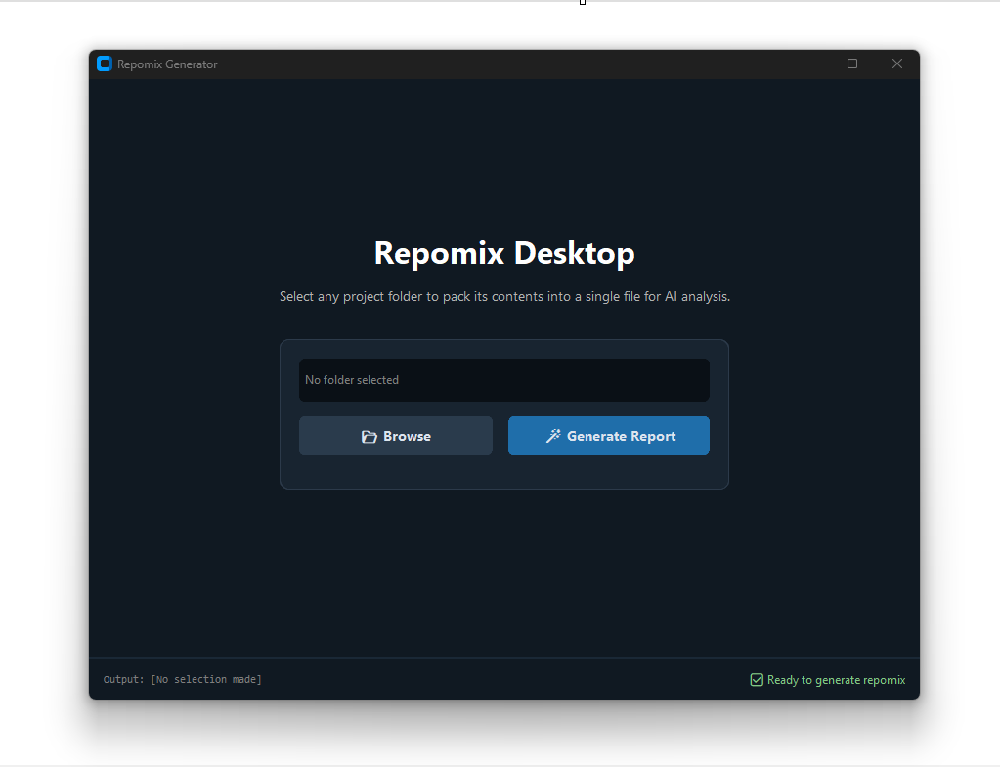

# Repomix GUI

Note: This project has **no official** connection to [Repomix](https://github.com/yamadashy/repomix) .

This is an **unofficial** GUI wrapper that provides a user-friendly desktop interface for [Repomix](https://github.com/yamadashy/repomix) instead of using it in the terminal. This is only a GUI wrapper and you must have Node installed to use it.

While this desktop application runs on its own, it acts as a bridge to the Repomix engine, which means your system must have Node.js installed to actually generate the reports.



## Thanks

Obviously this couldn't exist without Repomix. In their own words: "Repomix is a powerful tool that packs your entire repository into a single, AI-friendly file. Perfect for when you need to feed your codebase to Large Language Models (LLMs) or other AI tools". 
Website: https://repomix.com/ GitHub: https://github.com/yamadashy/repomix

The look and feel of the app is all to do with CustomTkinter. In their own words: "CustomTkinter is a python desktop UI-library based on Tkinter, which provides modern looking and fully customizable widgets."
Website: https://customtkinter.tomschimansky.com/ GitHub: https://github.com/tomschimansky/customtkinter


## ⚠️ Important Prerequisite: Node.js

Because this app is simply a wrapper around the Repomix command-line tool, **you must have Node.js installed on your computer.** If you already use Repomix in the terminal, you can skip this. If not follow the steps below:

- Go to [Nodejs.org](https://nodejs.org/)
- Download and install the LTS (Long Term Support) version.
- Now you are good to go to download and use the .exe. (To use the .py file there are a few more prereqs. See below.)

## 📥 Download (Best for most users)

**Just want to use the app?**

This app is a standalone .exe and does not need to be installed itself.

- Go to [Releases](https://github.com/yourusername/repomix-gui/releases)
- Download `repomix-gui.exe` from the latest release
- Double-click to run (Note: The app will open without Node.js, but will fail to generate a report until Node is installed).

## 🚧 Issues

These may or may not be fixed, depending on how often they come up. The fix might even be to not use this GUI and just use Repomix in the terminal as originally intended. If you encounter frequent errors, please submit an issue on it.

- Error reporting is a little broken and definitely incomplete.
- If this program runs for a long time, the GUI may freeze. I haven't been able to get the program to do this so I haven't bothered with a fix.
- env and log files are hardcoded to be ignored. This really shouldn't be much of an issue but the fact that it is not configurable should be noted.
- This isn't really an issue and if you are downloading the .exe, you can ignore it. If you are running the Python file directly, make sure to install [CustomTkinter](https://customtkinter.tomschimansky.com/) first. Instructions are below.

## 🧑‍💻 For Developers

### Skip the .exe and run the Python file directly

It is intended to be used by running the .exe, but you can 100% run the .py file directly if you prefer. However if you do, you need to have [CustomTkinter](https://customtkinter.tomschimansky.com/) installed. Do that with the following command:

```bash
pip install customtkinter
```

Next, simply save the `repomix_gui.py` file to your computer. Open a terminal in that same folder and run the following command in the terminal:

```bash
python repomix_gui.py
```

### Build and Customize Your Own Executable

If you want to make changes to the program, edit the `repomix_gui.py` file and then make the executable by running:

```bash
pip install customtkinter pyinstaller
pyinstaller --onefile --windowed --collect-all customtkinter repomix_gui.py
```

## 🛠️Requirements

- Node.js and npm (needed to run Repomix).
- Python 3.6+ (Only if running from source, not needed to run the .exe).
- [CustomTkinter](https://customtkinter.tomschimansky.com/) if you are running the .py file.

## Credits and Legal

### Credits & Legal

This project is a GUI wrapper for [Repomix](https://github.com/yamadashy/repomix) (MIT Licensed).

This GUI is licensed under **CC BY-NC-SA 4.0**. It is free for personal use but may not be used for commercial purposes without permission.
